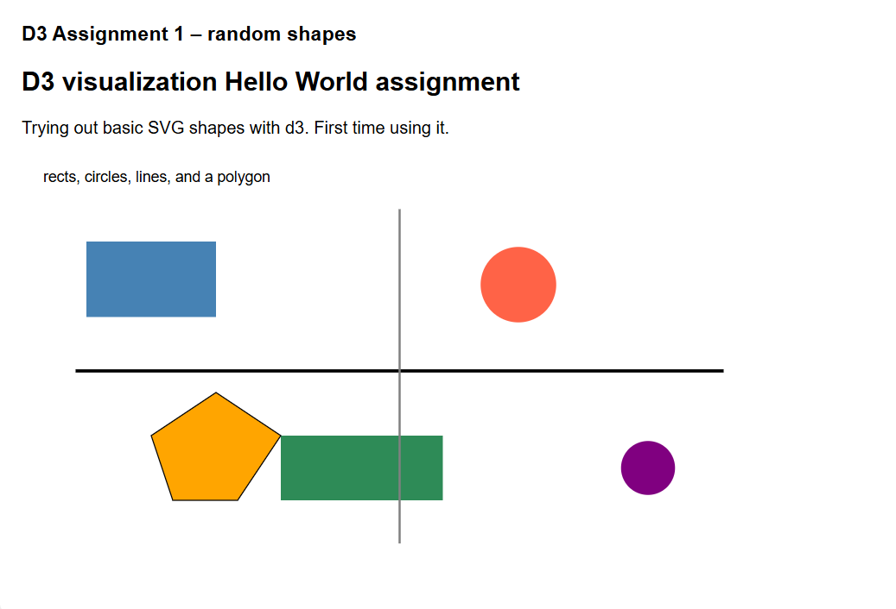
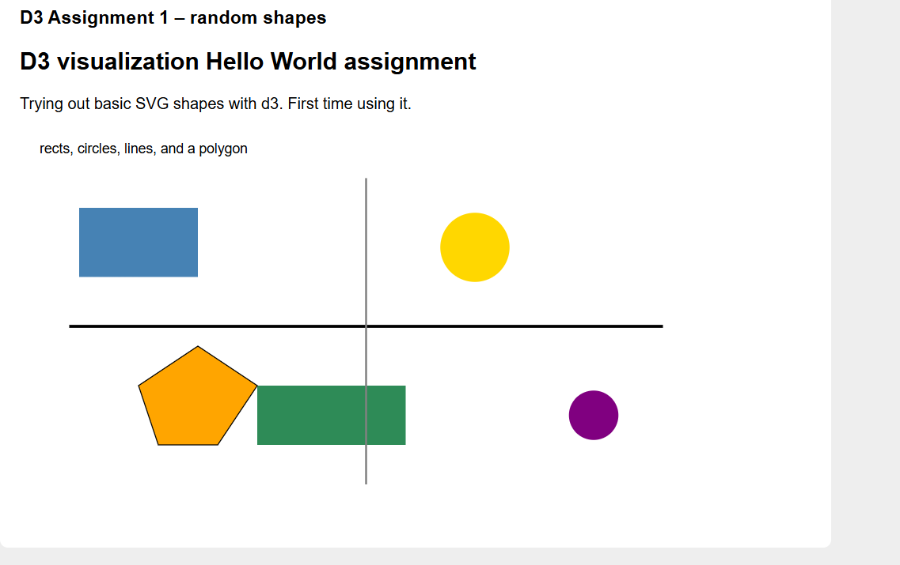

# Assignment 1 –  A1 Hello World with d3

This project is a simple introduction to using d3.js to create and display basic SVG graphics on a webpage. The goal was to practice drawing different graphical primitives and hosting the visualization using GitHub Pages.

## Live Demo
https://adityaapatel.github.io/a1-ghd3/index.html

## Description
The visualization displays several basic SVG shapes created using d3.js, including rectangles, circles, lines, and a polygon (path). Each shape is placed at a different location on the screen and uses a different color. This project was built to get familiar with d3 syntax and how SVG elements work.

## Screenshots
Below are screenshots of the visualization.  
Hovering over the circle changes its color.

## Technical Achievements
- Used d3.js to create and position SVG primitives such as rectangles, circles, lines, and a polygon.
- Implemented a simple mouse hover interaction on one of the shapes to explore basic event handling.
- Set up and hosted the project using GitHub Pages.

## Design Achievements
- Used different colors to clearly distinguish between each type of shape.
- Arranged the shapes so they do not overlap and are easy to view on the canvas.

## Sources
- d3.js v7 (loaded via CDN): https://d3js.org  
- No external starter code was used beyond the d3 library.
